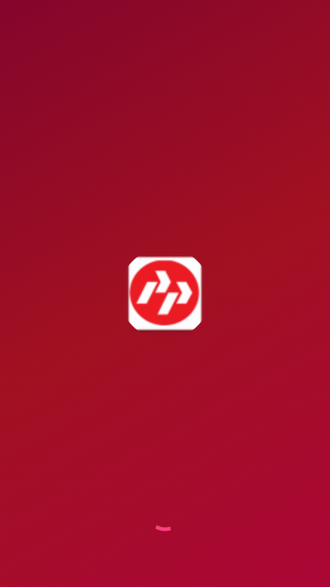
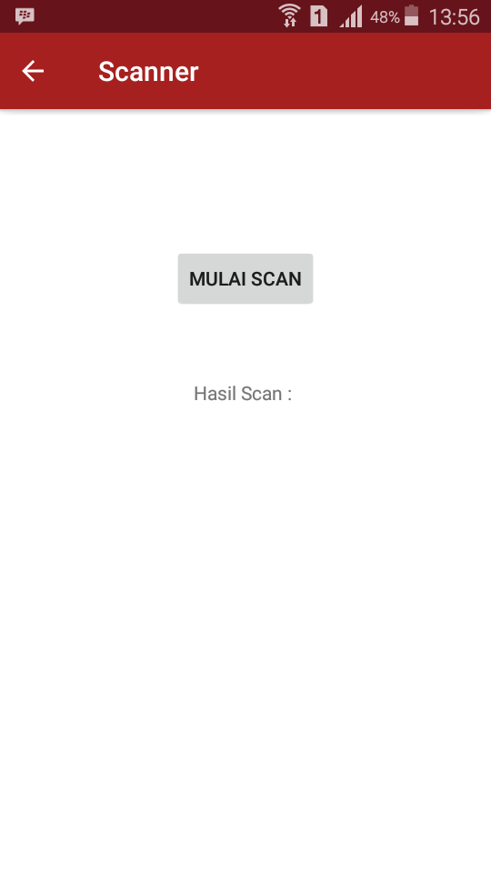
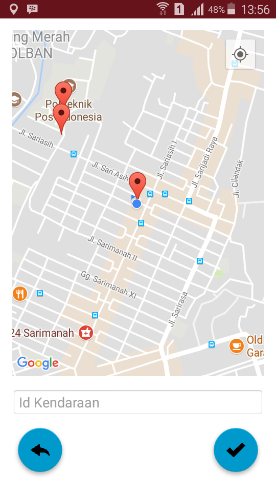
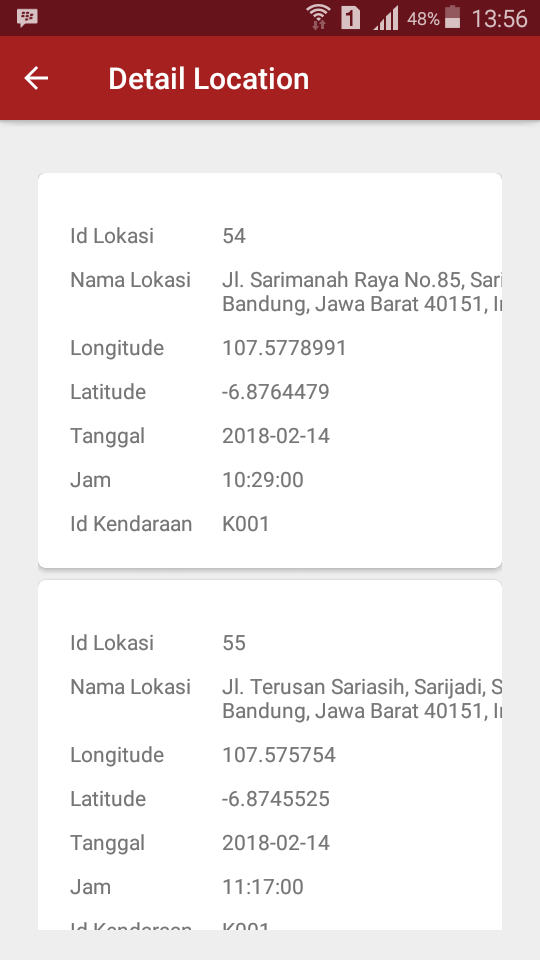
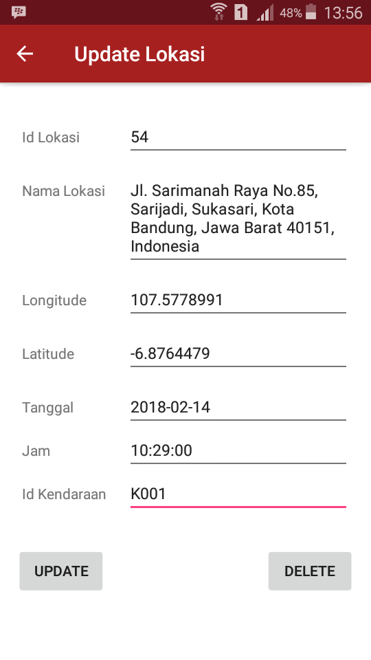
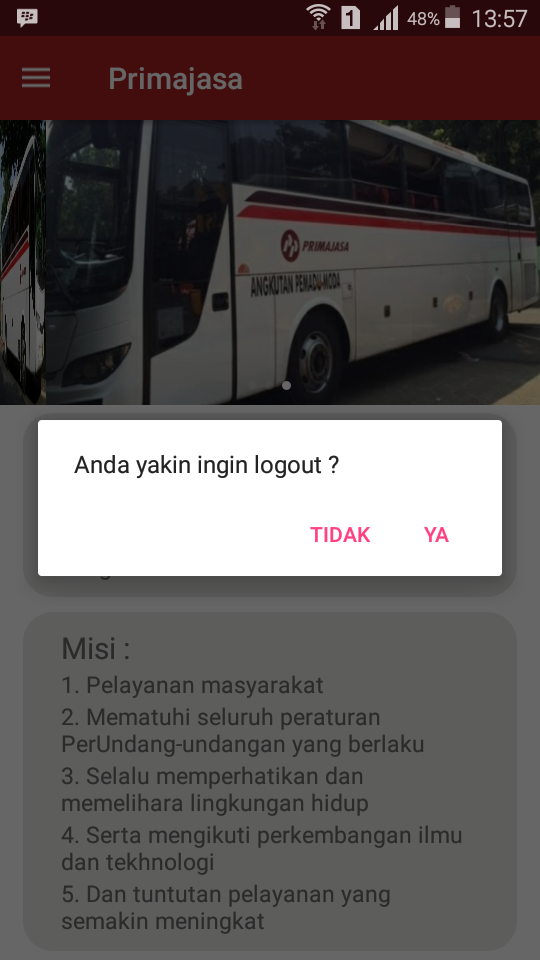

# Aplikasi Pemesanan Ticket Berbasis Web V.2

## Deskripsi Aplikasi :
1.  Kelanjutan dari <a href="https://github.com/rrifafauzikomara/Aplikasi-Pemesanan-Ticket-Berbasis-Web-V.1">sini</a>
2.  Mempunyai 3 actor : user biasa, user member (login) dan admin (login)
3.  Untuk login admin : user = admin dan pass = admin
4.  Untuk menu Lokasi, didapatkan setelah melakukan tracking berbasi mobile (android) dengan menginputkan lokasi berdasarkan id kendaraan (no polisi bus)
5.  Untuk demo aplikasi android bisa di download di <a href="https://drive.google.com/open?id=18y97hdUn3PcDtWGa0ia4rhgtlrdo24Jd">sini</a>
6.  Untuk demo login aplikasi android : user = rifa dan pass : fauzi
7.  Jika melakukan register, harap verifikasi akun tersebut melaui website <a href="http://r-fauzi.xyz">saya</a> dibagian admin, jika sudah makan akun tersebut dapat login aplikasi android.

## Screenshot Aplikasi Android
<pre>
                                             
</pre>

<pre>
                                    
</pre>

## Demo Aplikasi Website
Untuk Demo Website <a href="http://r-fauzi.xyz">Klik</a>

## Demo Aplikasi Android
Donwload dan Install Aplikasinya di <a href="https://drive.google.com/open?id=18y97hdUn3PcDtWGa0ia4rhgtlrdo24Jd">sini</a>
 Note : Pilih yang "debug" untuk di install, karna yang release untuk di upload di PlayStore

### Source Code
Link Source Code Android : <a href="https://gitlab.com/rrifafauzikomara/Tracking">Klik Me</a>
Link Source Code API dan Website : <a href="https://gitlab.com/rrifafauzikomara/Website">Klik Me</a>

### Petunjuk menjalankan source code aplikasi
Jika anda ingin menjalankan aplikasi android secara local menggunakan IP jaringan laptop dan HP anda, silahkan ganti IPnya di file ***Server.java***
